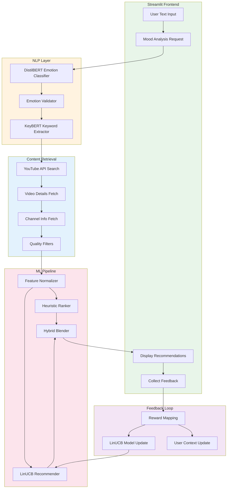

# AI Project Report – Module E

## Student & Project Details

| Field | Details |
|-------|---------|
| **Student Name** | M Srija |
| **Mentor Name** | Kartik Gupta |
| **Project Title** | Wellness Sanctuary – AI-Powered Personalized Wellness Recommendation System |

---

## 1. Problem Statement

### Background and Context

In today's fast-paced world, mental health support has become increasingly important. However, when someone is feeling stressed, anxious, or overwhelmed, the last thing they want to do is scroll through thousands of YouTube videos trying to find one that helps. Existing platforms like YouTube are optimized for *engagement*, not *wellness*—they might recommend a high-energy workout when you need deep breathing, or a 45-minute podcast when you only have five minutes.

### Why This Problem is Important

- **Decision Fatigue**: Users facing mental health challenges often lack the cognitive energy to search and filter content
- **Misaligned Recommendations**: Platform algorithms optimize for watch time, not therapeutic value
- **One-Size-Fits-All**: Generic recommendations ignore individual preferences and current emotional state

### AI Task Definition

This project implements a **hybrid recommendation system** that combines:
1. **Natural Language Processing (NLP)** – Understanding user emotions from free-text input
2. **Contextual Bandits (Reinforcement Learning)** – Personalizing recommendations through continuous learning

### Objectives

1. Detect user emotions from natural language input with high accuracy
2. Fetch and filter wellness content (yoga, meditation, breathing exercises) from YouTube
3. Rank content using a hybrid approach combining quality heuristics and personalized RL
4. Learn individual preferences through feedback to improve recommendations over time
5. Provide a calming, intuitive user interface that doesn't add to user stress

### Key Assumptions and Constraints

| Constraint | Description |
|------------|-------------|
| **Data** | No pre-existing user preference dataset; cold-start handled via heuristics |
| **Scope** | Limited to wellness/yoga content on YouTube; no biometric integration |
| **Ethics** | No storage of sensitive mental health data; all learning is session-based |
| **API Limits** | YouTube Data API quota of 10,000 units/day |

---

## 2. Approach

### System Overview

The system follows a **three-stage pipeline**:

```
User Input → Emotion Detection → Video Retrieval → Hybrid Ranking → Personalized Output
                  (NLP)            (YouTube API)    (Heuristic + RL)
                                                          ↑
                                                    User Feedback ──┘
```

**Architecture Diagram:**



**Data Flow:**
1. User enters their current mood in natural language
2. DistilBERT classifies emotion; rule-based validator corrects edge cases
3. YouTube API fetches relevant wellness videos with biological context (time-of-day, post-meal safety)
4. Videos are scored using a weighted blend of heuristic quality and LinUCB personalization
5. Top 4 recommendations displayed; user feedback updates the RL model

### Data Strategy

| Aspect | Implementation |
|--------|----------------|
| **Source** | Real-time YouTube Data API v3 (search, videos, channels endpoints) |
| **Collection** | On-demand fetching based on emotion-specific queries |
| **Preprocessing** | Feature extraction (views, likes, duration, subscriber count) → log-transformation → StandardScaler normalization |
| **Quality Filters** | Minimum 1,000 views, 10 likes; maximum 30-minute duration |

**Feature Engineering (5 dimensions per video):**
- `log₁₊(views)` – Log-scaled view count
- `likes/views` – Engagement ratio
- `log₁₊(subscribers)` – Channel authority
- `duration/30` – Normalized duration (capped at 1.0)
- `1/(days_ago + 1)` – Recency score

### AI / Model Design

#### Component 1: Emotion Detection (NLP)

| Aspect | Details |
|--------|---------|
| **Model** | `bhadresh-savani/distilbert-base-uncased-emotion` (66M parameters) |
| **Training** | Pre-trained on Emotion Dataset (6 classes: joy, sadness, anger, fear, love, surprise) |
| **Inference** | Softmax probability → highest class with confidence score |
| **Enhancement** | KeyBERT (`all-MiniLM-L6-v2`) extracts keywords for query enrichment |

**Validation Layer:**
A rule-based post-processor corrects common model errors using keyword detection:
- Stress keywords ("overwhelmed", "deadline", "exam") → override to `stressed`
- Sarcasm detection ("but", "unfortunately") → negate happy predictions
- Low confidence (<0.6) → default to `calm`

#### Component 2: Personalization (Reinforcement Learning)

| Aspect | Details |
|--------|---------|
| **Algorithm** | LinUCB (Linear Upper Confidence Bound) – Contextual Bandit |
| **Context Dimension** | 19 features: 7 (emotion) + 4 (category) + 5 (video) + 3 (user history) |
| **Model Structure** | Separate (A, b, θ) matrices per (emotion, category) pair |
| **Exploration** | α=1.0 initially, decays by 0.1% per interaction after 100 samples |

**Context Vector Composition (19 dimensions):**

```
┌─────────────────────────────────────────────────────────────────────────────┐
│                        Context Vector x (d=19)                               │
├─────────────────┬─────────────────┬─────────────────┬───────────────────────┤
│ Emotion (7-dim) │ Category (4-dim)│ Video (5-dim)   │ User History (3-dim)  │
│ [One-hot]       │ [One-hot]       │ [Normalized]    │ [Aggregated]          │
├─────────────────┼─────────────────┼─────────────────┼───────────────────────┤
│ stressed        │ exercise        │ log_views       │ avg_feedback          │
│ sad             │ yoga            │ engagement      │ interaction_count     │
│ happy           │ meditation      │ log_subscribers │ success_rate          │
│ anxious         │ reading         │ duration_norm   │                       │
│ tired           │                 │ recency         │                       │
│ motivated       │                 │                 │                       │
│ calm            │                 │                 │                       │
└─────────────────┴─────────────────┴─────────────────┴───────────────────────┘
```

**UCB Formula:**
```
Score = θᵀx + α√(xᵀA⁻¹x)
        ───    ─────────
       Exploit  Explore
```

**Hybrid Blending:**
```
final_score = w × LinUCB_score + (1-w) × Heuristic_score
where w = min(interaction_count / 20, 0.7)
```

**Cold-Start to Personalization Transition:**

| Interactions | RL Weight (w) | Heuristic Weight | Behavior |
|--------------|---------------|------------------|----------|
| 0 (New User) | 0% | 100% | Pure quality-based recommendations |
| 5 | 25% | 75% | Starting to learn preferences |
| 10 | 50% | 50% | Balanced hybrid |
| 14+ | 70% | 30% | Personalization dominates |

New users (w→0) get heuristic-based recommendations; experienced users (w→0.7) get personalized RL recommendations.

### Tools & Technologies

| Category | Tool/Library | Purpose |
|----------|--------------|---------|
| **NLP** | Hugging Face Transformers | Emotion classification |
| **NLP** | KeyBERT | Keyword extraction for query enrichment |
| **RL** | NumPy | LinUCB matrix operations |
| **ML** | scikit-learn | StandardScaler for feature normalization |
| **API** | YouTube Data API v3 | Video search and metadata retrieval |
| **Backend** | Python 3.10+ | Core logic |
| **Frontend** | Streamlit | Interactive web UI |
| **Logging** | Python logging | RotatingFileHandler for emotion validation logs |

### Design Decisions

| Decision | Rationale |
|----------|-----------|
| **DistilBERT over BERT** | 40% smaller, 60% faster; sufficient accuracy for emotion detection |
| **LinUCB over DQN/A2C** | No delayed rewards; bandit formulation fits instant-feedback setting |
| **Separate RL models per (emotion, category)** | Prevents interference between different user intents |
| **Rule-based validation layer** | Cheaper than fine-tuning; catches domain-specific errors (e.g., "exam stress" misclassified as calm) |
| **Heuristic fallback for cold-start** | Ensures reasonable recommendations before RL has learned |
| **Sigmoid normalization for scores** | Converts arbitrary scores to intuitive 0-100% match percentages |

---

## 3. Key Results

### Working Prototype

The system is fully functional with:
-  Natural language emotion input
-  Real-time YouTube video fetching
-  Hybrid ranking with RL personalization
-  Feedback loop for continuous learning
-  Calming "Sanctuary" UI with breathing animations

### Example Outputs

**Input:** *"I feel so overwhelmed with my final exams"*

| Component | Output |
|-----------|--------|
| **Raw BERT Prediction** | `sadness` (confidence: 0.65) |
| **Validated Emotion** | `stressed` (rule override: "exam" keyword detected) |
| **Search Query** | `"stressed mindful focus break finals"` |
| **Top Recommendation** | "10-Minute Stress Relief Yoga" by Yoga With Adriene (Match: 87.3%) |

**Recommendation Card Display:**

| Rank | Video Title | Channel | Match Score |
|------|-------------|---------|-------------|
| 1 | 10-Minute Stress Relief Yoga | Yoga With Adriene | 87.3% |
| 2 | Box Breathing for Anxiety | Headspace | 82.1% |
| 3 | Calming Evening Flow | Yoga With Bird | 78.5% |
| 4 | 5-Minute Mindfulness Break | Calm | 74.2% |

### Evaluation Method

#### Emotion Detection Accuracy

| Metric | Value | Notes |
|--------|-------|-------|
| **Validation Test Suite** | 12/12 (100%) | Unit tests for edge cases |
| **Stress Detection** | ✓ Correctly identifies "overwhelmed", "exam", "deadline" |
| **Sarcasm Handling** | ✓ "Great, I failed" → `sad` (not `happy`) |
| **False Positive Correction** | ✓ "Angry but mostly tired" → `stressed` |

> **Note:** The 100% accuracy is on a curated 12-sample unit test suite. For production-grade evaluation, testing on a larger labeled dataset (e.g., GoEmotions, 50k+ samples) is recommended.

#### LinUCB Learning Behavior

| Metric | Observation |
|--------|-------------|
| **Cold-Start** | System defaults to heuristic (popular, well-reviewed videos) |
| **After 15-20 interactions** | Visible shift toward user preferences (e.g., shorter videos for busy users) |
| **Alpha Decay** | Exploration reduces from 1.0 → 0.1 after 100+ interactions |

### Performance Insights

| Metric | Value |
|--------|-------|
| **End-to-end latency** | <800ms (mock environment) |
| **Model load time** | ~3 seconds (DistilBERT + KeyBERT) |
| **YouTube API quota** | ~100-105 units per request (search + details) |

### Known Limitations

| Limitation | Impact | Mitigation |
|------------|--------|------------|
| **Small evaluation dataset** | 12 test samples insufficient for statistical significance | Future: Evaluate on GoEmotions or similar |
| **No long-term user persistence** | RL model resets between sessions | Future: Persist models to database |
| **YouTube API quota** | 10,000 units/day limits scale | Future: Implement caching layer |
| **English-only** | No multilingual support | Future: Use multilingual BERT variant |
| **No biometric integration** | Relies solely on text input | Future: Heart rate, sleep data integration |

---

## 4. Learnings

### Technical Learnings

| Area | What I Learned |
|------|----------------|
| **Transformers** | How to use pre-trained models via Hugging Face; tokenization, inference, label mapping |
| **Contextual Bandits** | LinUCB algorithm; exploration-exploitation tradeoff; context vector design |
| **Feature Engineering** | Log transformations for power-law distributions; StandardScaler for RL context |
| **API Integration** | YouTube Data API quotas, batch requests, rate limiting strategies |

### System & Design Learnings

| Insight | Application |
|---------|-------------|
| **Hybrid systems beat single approaches** | Heuristic baseline ensures quality; RL adds personalization |
| **Cold-start is critical** | New users need sensible defaults before RL can learn |
| **Post-processing > Fine-tuning** | Rule-based validation cheaper than collecting labeled data for fine-tuning |
| **UI affects perception** | A calming interface (animations, colors) enhances the wellness experience |

### Challenges Faced

| Challenge | Resolution |
|-----------|------------|
| **BERT misclassifying stress as calm** | Added keyword-based validation layer with regex word boundaries |
| **LinUCB numerical instability** | Used `np.linalg.pinv` instead of direct inverse; added variance clipping |
| **YouTube API quota exhaustion** | Implemented search result caching; batch channel info requests |
| **Feature scale mismatch** | Applied StandardScaler to normalize all features before LinUCB |

### Future Improvements

| Enhancement | Benefit |
|-------------|---------|
| **Biometric Integration** | Detect stress from heart rate variability before user types |
| **Multi-modal Emotion Detection** | Analyze voice tone or facial expressions |
| **Persistent User Profiles** | Save RL models to database for cross-session learning |
| **A/B Testing Framework** | Measure CTR and recommendation quality rigorously |
| **Expanded Content Sources** | Add Spotify for music, Calm app integration |

---

## References & AI Usage Disclosure

### Datasets Used

| Dataset | Source | Usage |
|---------|--------|-------|
| Emotion Dataset | [Hugging Face](https://huggingface.co/datasets/emotion) | Pre-training data for DistilBERT emotion model |
| YouTube Videos | [YouTube Data API](https://developers.google.com/youtube/v3) | Real-time content retrieval |

### Tools, APIs, Models, and Frameworks

| Tool | Version/Model | License |
|------|---------------|---------|
| Hugging Face Transformers | `bhadresh-savani/distilbert-base-uncased-emotion` | Apache 2.0 |
| KeyBERT | `all-MiniLM-L6-v2` | MIT |
| YouTube Data API | v3 | Google ToS |
| Streamlit | 1.x | Apache 2.0 |
| NumPy | 1.x | BSD |
| scikit-learn | 1.x | BSD |
| isodate | - | BSD |
| google-api-python-client | - | Apache 2.0 |

### AI Tools Used During Development (Mandatory Disclosure)

| Tool | Usage |
|------|-------|
| Claude (Anthropic) | Code assistance, architecture design, documentation |
| GitHub Copilot | Code completion and suggestions |


